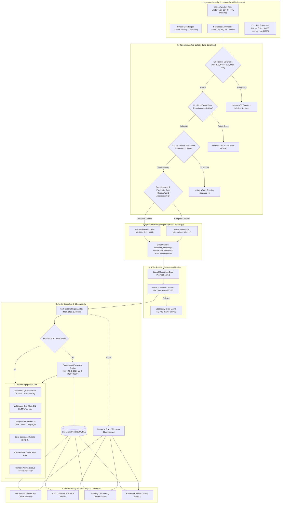
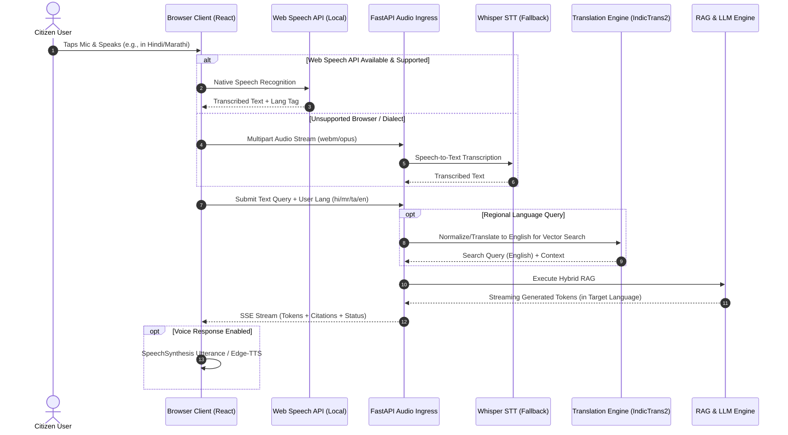

# 🏛️ Nagrik AI: System Architecture & Technical Specifications

> **System Overview**: High-concurrency, multilingual municipal intelligence platform designed for municipal corporations, smart cities, and urban local bodies (ULBs). Integrates Hybrid Vector RAG, Multilingual Speech/Text Processing, Autonomous Department Escalation, and Executive Decision Support.

---

## 1. High-Level Component Topology



---

## 2. Multilingual Speech & Text Architecture

### 2.1 Low-Latency Audio Streaming Pipeline


---

## 3. Database Schema (Supabase PostgreSQL with RLS)

```sql
-- 1. Municipal Wards & Zones
CREATE TABLE municipal_wards (
    ward_id INT PRIMARY KEY,
    ward_name VARCHAR(100) NOT NULL,
    zone_name VARCHAR(100) NOT NULL,
    ward_officer_name VARCHAR(150),
    ward_office_address TEXT,
    contact_email VARCHAR(150),
    contact_phone VARCHAR(50),
    created_at TIMESTAMPTZ DEFAULT NOW()
);

-- 2. Municipal Departments
CREATE TABLE municipal_departments (
    dept_code VARCHAR(10) PRIMARY KEY, -- WTR, SAN, REV, ENG, TNP, ELE, HLT
    dept_name VARCHAR(150) NOT NULL,
    head_officer_email VARCHAR(150),
    escalation_email VARCHAR(150),
    standard_sla_hours INT DEFAULT 48
);

-- 3. Citizen Conversations
CREATE TABLE conversations (
    id UUID PRIMARY KEY DEFAULT gen_random_uuid(),
    user_id UUID REFERENCES auth.users(id) ON DELETE CASCADE,
    title VARCHAR(255) DEFAULT 'New Inquiry',
    ward_id INT REFERENCES municipal_wards(ward_id),
    language_code VARCHAR(10) DEFAULT 'en',
    is_pinned BOOLEAN DEFAULT FALSE,
    created_at TIMESTAMPTZ DEFAULT NOW(),
    updated_at TIMESTAMPTZ DEFAULT NOW()
);

-- 4. Conversation Messages
CREATE TABLE messages (
    id UUID PRIMARY KEY DEFAULT gen_random_uuid(),
    conversation_id UUID REFERENCES conversations(id) ON DELETE CASCADE,
    role VARCHAR(20) NOT NULL CHECK (role IN ('user', 'assistant', 'system')),
    content TEXT NOT NULL,
    citations JSONB DEFAULT '[]'::jsonb,
    metrics JSONB DEFAULT '{}'::jsonb,
    created_at TIMESTAMPTZ DEFAULT NOW()
);

-- 5. Grievances & Service Escalations
CREATE TABLE grievances (
    ticket_id VARCHAR(50) PRIMARY KEY, -- MNC-2026-W04-WTR-8942
    conversation_id UUID REFERENCES conversations(id) ON DELETE SET NULL,
    user_id UUID REFERENCES auth.users(id) ON DELETE SET NULL,
    citizen_name VARCHAR(150),
    citizen_phone VARCHAR(20),
    citizen_email VARCHAR(150),
    ward_id INT REFERENCES municipal_wards(ward_id),
    dept_code VARCHAR(10) REFERENCES municipal_departments(dept_code),
    category VARCHAR(100) NOT NULL, -- Water Leakage, Pothole, Garbage, Tax Dispute
    priority VARCHAR(20) NOT NULL CHECK (priority IN ('emergency', 'high', 'medium', 'standard')),
    sla_deadline TIMESTAMPTZ NOT NULL,
    status VARCHAR(30) DEFAULT 'submitted' CHECK (status IN ('submitted', 'in_progress', 'resolved', 'escalated')),
    resolution_notes TEXT,
    created_at TIMESTAMPTZ DEFAULT NOW(),
    updated_at TIMESTAMPTZ DEFAULT NOW()
);

-- 6. Row-Level Security (RLS) Policies
ALTER TABLE conversations ENABLE ROW LEVEL SECURITY;
ALTER TABLE messages ENABLE ROW LEVEL SECURITY;
ALTER TABLE grievances ENABLE ROW LEVEL SECURITY;

CREATE POLICY "Citizens manage their own conversations"
ON conversations FOR ALL USING (auth.uid() = user_id);

CREATE POLICY "Citizens access their conversation messages"
ON messages FOR ALL USING (
    EXISTS (SELECT 1 FROM conversations WHERE conversations.id = messages.conversation_id AND conversations.user_id = auth.uid())
);

CREATE POLICY "Citizens view their own grievances"
ON grievances FOR SELECT USING (auth.uid() = user_id OR auth.uid() IS NULL);

CREATE POLICY "Admin role access all grievances"
ON grievances FOR ALL USING (
    (auth.jwt() ->> 'role') = 'municipal_admin'
);
```

---

## 4. Qdrant Hybrid Collection Payload Schema

* **Collection Name**: `municipal_knowledge`
* **Vectors**:
  * `dense`: 384-dimensional Cosine distance (`sentence-transformers/all-MiniLM-L6-v2`)
  * `sparse`: Lexical term frequency (`Qdrant/bm25`)
* **Payload Fields**:
  ```json
  {
    "doc_id": "MNC-DOC-REV-2026-004",
    "title": "Property Tax Assessment Bylaws 2026",
    "department": "REV",
    "document_type": "bylaw", // bylaw, circular, gazette, citizen_charter, water_tariff
    "ward_scope": "all",      // 'all' or specific ward integer
    "effective_date": "2026-04-01",
    "section_ref": "Section 14(b)",
    "text": "Commercial properties within Zone B are subject to a 1.8% annual capital value rate with a 10% rebate for online payments made before May 31...",
    "source_url": "https://municipal.gov.in/docs/property-tax-2026.pdf",
    "chunk_id": "REV-2026-004-p03-c02"
  }
  ```

---

## 5. Autonomous Department Escalation Engine

### 5.1 Departmental Code & SLA Mapping Table

| Dept Code | Department Name | Scope / Issue Types | Emergency SLA | Standard SLA |
| :--- | :--- | :--- | :--- | :--- |
| **`WTR`** | Water Supply & Sewerage | Main pipeline burst, sewage overflow, contaminated drinking water, meter faults. | 4 Hours | 24 Hours |
| **`SAN`** | Solid Waste Management | Unattended community bins, dead animal removal, illegal garbage dumping, drain silt. | 6 Hours | 24 Hours |
| **`REV`** | Property Tax & Revenue | Double assessment, payment receipt failure, tax slab disputes, name change. | 24 Hours | 7 Days |
| **`ENG`** | Roads & Civil Engineering | Cave-ins, hazardous potholes, damaged footpaths, broken stormwater culverts. | 4 Hours | 48 Hours |
| **`TNP`** | Town Planning & Encroachment | Unauthorized building construction, footpath encroachment, tree obstruction. | 12 Hours | 7 Days |
| **`ELE`** | Electrical & Streetlighting | Exposed live cables, streetlight dark zones, broken junction boxes. | 2 Hours | 24 Hours |

### 5.2 Ticket Generation Algorithm
$$	ext{Ticket ID} = 	ext{"MNC-" + YEAR + "-W" + WARD\_ID + "-" + DEPT\_CODE + "-" + SHA256(citizen\_id + timestamp)[:4].upper()}$$
Example: `MNC-2026-W04-WTR-78B2`

---

## 6. Administrative Decision-Support Specifications

1. **Spatial Ward Heatmap**: Aggregates ticket count per $1,000$ residents per ward. If a ward exceeds $2\sigma$ above city baseline, trigger an administrative red alert.
2. **SLA Countdown Timer**: Visual countdown chip (Green > 12h, Amber 4-12h, Red < 4h, Flashing Red = Breached).
3. **FAQ Clustering**: Dynamic K-Means / TF-IDF clustering of daily citizen queries to identify policy friction points (e.g., sudden $300\%$ increase in queries about "Solar rooftop subsidy rules").
4. **Knowledge-Gap Monitor**: Log queries where RRF top score was $< 0.45$. Automatically compile a weekly "Missing Policy Circulars" report for the Municipal Secretary.

---

## 7. Knowledge Corpus & Local Asset Resolution

To prevent broken or dead links in the citizen UI, all citations resolve through a dual-path mechanism:
1. **Local Authoritative Markdown/PDF (`source_path`)**:
   - Stored in `data/corpus/` (e.g., `data/corpus/property_tax_bylaws_2026.md`, `data/corpus/water_supply_charter_2026.md`).
   - Served via FastAPI document endpoint: `/api/v1/documents/{doc_id}/download` or viewed inline.
2. **Official Government Portal Reference (`official_portal_ref`)**:
   - Links to real government department portals (e.g., Ministry of Housing and Urban Affairs `https://mohua.gov.in`).
   - Citation hover cards display both: "View Local Official Gazette" and "Open Ministry Portal".
