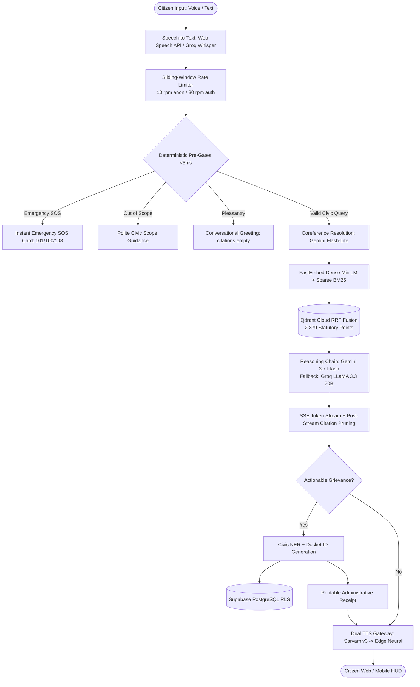

# 🏛️ Nagrik AI (नागरिक AI) — Enterprise Municipal RAG & Decision Support System

<p align="center">
  
  
  
  
  
</p>

---

## 📑 Table of Contents

- [1. Executive Summary & Vision](#1-executive-summary--vision)
- [2. NLP Architecture & Technical Innovations](#2-nlp-architecture--technical-innovations)
  - [2.1 Hybrid Dense-Sparse Vector Retrieval with Server-Side RRF](#21-hybrid-dense-sparse-vector-retrieval-with-server-side-rrf)
  - [2.2 Deterministic NLP Pre-Gates (<5ms Response)](#22-deterministic-nlp-pre-gates-5ms-response)
  - [2.3 Multi-Turn Coreference Resolution](#23-multi-turn-coreference-resolution)
  - [2.4 Strict Post-Stream Citation Pruning](#24-strict-post-stream-citation-pruning)
  - [2.5 Civic Named Entity Recognition (NER) & Escalation Routing](#25-civic-named-entity-recognition-ner--escalation-routing)
  - [2.6 Dual-Engine Multilingual Speech Gateway](#26-dual-engine-multilingual-speech-gateway)
- [3. End-to-End System Pipeline](#3-end-to-end-system-pipeline)
- [4. Statutory Knowledge Base Corpus](#4-statutory-knowledge-base-corpus)
- [5. Production Deployment Status](#5-production-deployment-status)
- [6. Repository Structure](#6-repository-structure)
- [7. Getting Started & Local Installation](#7-getting-started--local-installation)
- [8. Verification & Test Suite](#8-verification--test-suite)

---

## 1. Executive Summary & Vision

**Nagrik AI (नागरिक AI)** is a production-grade, AI-driven Municipal Knowledge Assistant and Administrative Decision Support System built to bridge the gap between citizens and municipal corporations across India.

Operating across voice and text in multiple Indian languages (Hindi, Marathi, Tamil, Telugu, Bengali, Gujarati, Kannada, and English), Nagrik AI grounds every factual statement in official Government of India gazettes, statutory bylaws, and municipal circulars.

### Dual-Stakeholder Architecture:
1. **Citizens (Civic Concierge)**:
   - Voice-first conversational RAG in regional Indic languages.
   - Non-hallucinatory answers for property tax, water tariffs, building permits, trade licenses, birth/death registration, and sanitation schedules.
   - Sub-5ms Emergency SOS safety filter (101 Fire, 100 Police, 108 Ambulance, 1916 Disaster Helpline).
   - Automated civic grievance lodgment with standardized dockets and printable administrative receipts.
2. **Municipal Administrators & Ward Officers (Executive Workstation)**:
   - Live spatial grievance heatmaps across municipal wards with 2-sigma anomaly detection.
   - SLA countdown monitor tracking response deadlines by department (Water, Sanitation, Roads, Electrical, Revenue, Town Planning).
   - Real-time statutory document ingestion and verification portal with SHA-256 deduplication.

---

## 2. NLP Architecture & Technical Innovations

### 2.1 Hybrid Dense-Sparse Vector Retrieval with Server-Side RRF

Civic governance queries present unique linguistic challenges:
* **Colloquial Citizen Descriptions**: *"dirty brown water coming from tap"* requires semantic understanding.
* **Statutory Alphanumeric References**: *"Circular No. 492/B"*, *"Form 3A"*, *"Section 128(1)(a)"*, or *"Ward 04"* fail on purely semantic models due to out-of-vocabulary tokenization.

Nagrik AI addresses this using dual vector spaces fused at retrieval time:
* **Dense Semantic Space**: FastEmbed ONNX `sentence-transformers/all-MiniLM-L6-v2` (384-dimensional dense vectors, Cosine metric) capturing semantic intent.
* **Sparse Lexical Space**: FastEmbed BM25 (`Qdrant/bm25`) generating token-level IDF sparse vectors for exact statutory codes and ward names.
* **Server-Side Reciprocal Rank Fusion (RRF)**:
  $$\text{RRF\_Score}(d) = \sum_{m \in \{\text{dense}, \text{sparse}\}} \frac{1}{60 + \text{rank}_m(d)}$$
  Executed natively within Qdrant Cloud's Rust engine in under 20ms, eliminating client-side network roundtrips.

### 2.2 Deterministic NLP Pre-Gates (<5ms Response)

Before invoking LLMs or vector databases, input queries pass through a 4-tier deterministic classification pipeline:
1. **Emergency SOS Gate (<2ms)**: Regex keyword classification matching urgent hazards (`fire`, `gas leak`, `building collapse`, `cylinder blast`, `drowning`). Emits emergency hotlines immediately with zero LLM consumption.
2. **Municipal Scope Gate (<3ms)**: Negative taxonomy filter rejecting out-of-scope queries (e.g., coding, cinema, sports, general knowledge) with helpful civic redirection.
3. **Conversational Intent Gate (<2ms)**: Direct response generator for pleasantries (`hello`, `namaste`, `who are you?`), returning warm civic greetings with `citations: []`.
4. **Parameter Completeness Gate (<5ms)**: Detects missing entities (e.g. Ward Number or Assessment ID) for procedure-specific queries.

### 2.3 Multi-Turn Coreference Resolution

When citizens ask follow-up questions (e.g., *"How much is the penalty if I pay it late?"* or *"Who is the officer there?"*), Nagrik AI runs a fast contextualization pass via **Gemini 3.5 Flash-Lite**. It resolves pronouns (*"it"*, *"there"*, *"that certificate"*) against prior conversation history before dispatching to the hybrid retriever.

### 2.4 Strict Post-Stream Citation Pruning

To guarantee statutory authenticity and eliminate hallucinations:
* The LLM streams its response using strict citation markers `[S1]`, `[S2]`, etc.
* The post-stream auditor scans the emitted tokens. Any retrieved document chunk **not** explicitly referenced in the generated text is pruned from the metadata payload.
* If a response contains zero citation markers, `citations` returns strictly empty (`[]`), preventing misleading candidate displays.

### 2.5 Civic Named Entity Recognition (NER) & Escalation Routing

When citizen text contains actionable grievances, the rule-based civic NER classifier extracts:
* **Department Category**: `WTR` (Water), `SAN` (Sanitation), `REV` (Property Tax), `ENG` (Roads/Engineering), `TNP` (Town Planning), `ELE` (Electrical).
* **Ward Identification**: Normalized ward IDs (Wards 1–10 across Zones A–E).
* **Urgency & SLA Assignment**: Emergency (4h), High (24h), Medium (48h), Standard (7 days).
* **Standardized Ticket Format**: `MNC-{YEAR}-W{WARD}-{DEPT}-{HASH}` (e.g. `MNC-2026-W04-WTR-3891`).

### 2.6 Dual-Engine Multilingual Speech Gateway

* **Primary Engine**: **Sarvam AI (`bulbul:v3`)** providing natural, conversational Indic speech synthesis across regional languages with speaker `shreya`.
* **Instant Fallback Engine**: **Microsoft Edge Neural TTS (`edge-tts`)** providing sub-50ms offline fallback (e.g., `hi-IN-SwaraNeural`, `mr-IN-AarohiNeural`, `ta-IN-PallaviNeural`, `te-IN-ShrutiNeural`, `en-IN-NeerjaNeural`).
* **Circuit Breaker**: Automatic latching mechanism that switches to Edge-TTS upon quota exhaustion or network timeout.

---

## 3. End-to-End System Pipeline



---

## 4. Statutory Knowledge Base Corpus

Nagrik AI's knowledge base is grounded in official, un-hallucinated Government of India policy documents and gazettes indexed in Qdrant Cloud:

| Document Title | Issuing Authority | Scope & Coverage |
| :--- | :--- | :--- |
| **Solid Waste Management Rules, 2016** | Ministry of Environment, Forest & Climate Change | Waste segregation, commercial generator penalties, disposal schedules |
| **Manual on Water Supply and Treatment** | CPHEEO / MoHUA | Water quality standards, distribution hours, contamination remediation |
| **Urban & Regional Development Plans (URDPFI)** | Ministry of Housing and Urban Affairs | Zoning, building permissions, setback norms, FSI / FAR calculations |
| **Plastic Waste Management Rules** | Central Pollution Control Board (CPCB) | Single-use plastic bans, merchant compliance, violation penalties |
| **Street Vendors Act & Schemes** | Ministry of Housing and Urban Affairs | Vending zones, vending certificates, eviction protections, grievances |
| **Registration of Births and Deaths Act** | Ministry of Home Affairs / Citizen Charter | Statutory issuance timelines, delayed registration fees, correction rules |
| **Right to Information (RTI) Act, 2005** | Department of Personnel and Training | 30-day statutory response mandate, appellate procedure, public authorities |

Total indexed vectors: **2,379 high-density chunks** with multi-tenant keyword indexes on `scope`, `owner_user_id`, and `department`.

---

## 5. Production Deployment Status

* **Backend Gateway (Render)**: [`https://nagrik-ai-wvuw.onrender.com`](https://nagrik-ai-wvuw.onrender.com)
  * Health & Telemetry: [`https://nagrik-ai-wvuw.onrender.com/health`](https://nagrik-ai-wvuw.onrender.com/health)
  * Municipal Wards API: [`https://nagrik-ai-wvuw.onrender.com/api/v1/wards/`](https://nagrik-ai-wvuw.onrender.com/api/v1/wards/)
* **Database & Persistence**: Supabase PostgreSQL with Row Level Security (RLS)
* **Vector Store**: Qdrant Cloud (Australia-Southeast Cluster, HTTPS Port 443)
* **Frontend Workstation (Vercel)**: React 19 + TypeScript + Vite + Tailwind CSS

---

## 6. Repository Structure

```
.
├── backend/
│   ├── scripts/
│   │   ├── ingest.py                    # Statutory PDF streaming ingestion & FastEmbed indexing
│   │   └── test_db_connection.py        # Supabase and Qdrant connectivity validator
│   ├── src/
│   │   ├── api/
│   │   │   ├── dependencies.py          # Admin API key authentication & role enforcement
│   │   │   ├── middleware.py            # Memory-bounded sliding window rate limiter
│   │   │   └── routes/
│   │   │       ├── admin.py             # Executive decision support & 2-sigma heatmap
│   │   │       ├── chat.py              # Multi-turn SSE streaming chat with citation pruning
│   │   │       ├── documents.py         # Gazette upload, SHA-256 deduplication & download
│   │   │       ├── grievances.py        # Citizen grievance docket creation & tracking
│   │   │       ├── voice.py             # Dual-engine speech synthesis (Sarvam v3 + Edge TTS)
│   │   │       └── wards.py             # Spatial ward directory & contact routing
│   │   ├── config.py                    # Pydantic Settings with defensive key sanitization
│   │   ├── database/                    # Dual-mode persistence (Supabase PostgreSQL / SQLite)
│   │   ├── forecasting/                 # Civic NER classifier & departmental triage
│   │   ├── generator/                   # Gemini 3.7 Flash & Groq LLaMA 3.3 LLM clients
│   │   ├── main.py                      # FastAPI gateway with error-resilient lifespan startup
│   │   ├── multilingual/                # Whisper STT & language mapping utilities
│   │   └── retriever/                   # Qdrant Hybrid RRF retriever & Gov API router
│   └── tests/                           # 21 automated pytest test suites
├── data/
│   └── corpus/                          # Official Government of India statutory PDFs
├── docs/
│   └── adr/                             # Architectural Decision Records (ADRs)
├── frontend/
│   ├── src/
│   │   ├── components/                  # Living Ward Profile, Gazette Preview, Citation Cards
│   │   ├── lib/                         # Voice synthesizer, SSE streaming client, API client
│   │   └── App.tsx                      # Luxury Civic Workstation UI
│   └── package.json
├── render.yaml                          # Render Infrastructure-as-Code Blueprint
├── requirements.txt                     # Backend Python dependencies
└── pyproject.toml
```

---

## 7. Getting Started & Local Installation

### Prerequisites
* Python 3.11+ (Python 3.13 recommended)
* Node.js 18+ & npm
* Qdrant Cloud Cluster URL & API Key
* Supabase Account URL & Keys

### 1. Backend Setup
```bash
# Clone the repository
git clone https://github.com/RatishPatil37/NAGRIK-AI.git
cd NAGRIK-AI

# Create virtual environment
python -m venv .venv
source .venv/bin/activate  # On Windows: .venv\Scripts\activate

# Install dependencies
pip install -r requirements.txt

# Configure environment variables
cp .env.example .env
# Edit .env and enter your valid API keys (GEMINI_API_KEY, QDRANT_URL, QDRANT_API_KEY, SUPABASE_URL, etc.)

# Ingest government PDFs into Qdrant Cloud
python backend/scripts/ingest.py

# Launch FastAPI development server
uvicorn backend.src.main:app --host 0.0.0.0 --port 8000 --reload
```

### 2. Frontend Setup
```bash
cd frontend

# Install dependencies
npm install

# Start Vite development server
npm run dev
```

Visit `http://localhost:5173` to access the Citizen & Executive Workstation.

---

## 8. Verification & Test Suite

The test suite validates the entire deterministic safety net, RAG pipeline, rate limiter memory bounds, and API endpoints:

```bash
pytest backend/tests/ -v
```

### Test Results Summary:
```text
backend/tests/test_api_endpoints.py::test_health_check_endpoint PASSED           [  4%]
backend/tests/test_api_endpoints.py::test_wards_endpoint PASSED                  [  9%]
backend/tests/test_api_endpoints.py::test_admin_heatmap_and_sla PASSED           [ 14%]
backend/tests/test_api_endpoints.py::test_document_download PASSED               [ 19%]
backend/tests/test_api_endpoints.py::test_document_upload_and_deduplication PASSED [ 23%]
backend/tests/test_citations_strict.py::test_zero_citation_pruning PASSED       [ 28%]
backend/tests/test_citations_strict.py::test_selective_citation_pruning PASSED  [ 33%]
backend/tests/test_escalation.py::test_sla_calculation PASSED                    [ 38%]
backend/tests/test_escalation.py::test_ticket_id_format PASSED                   [ 42%]
backend/tests/test_escalation.py::test_triage_engine_routing PASSED              [ 47%]
backend/tests/test_guardrails.py::test_emergency_sos_speed_and_accuracy PASSED   [ 52%]
backend/tests/test_guardrails.py::test_scope_gate_rejection PASSED               [ 57%]
backend/tests/test_guardrails.py::test_intent_gate_pleasantries PASSED           [ 61%]
backend/tests/test_guardrails.py::test_completeness_gate PASSED                  [ 66%]
backend/tests/test_memory_bounds.py::test_rate_limiter_memory_bound PASSED       [ 71%]
backend/tests/test_memory_bounds.py::test_max_tracked_ip_cap PASSED              [ 76%]
backend/tests/test_rag_pipeline.py::test_post_stream_citation_pruning PASSED     [ 80%]
backend/tests/test_voice_and_gov_router.py::test_gov_api_router_classification PASSED [ 85%]
backend/tests/test_voice_and_gov_router.py::test_gov_api_router_telemetry_generation PASSED [ 90%]
backend/tests/test_voice_and_gov_router.py::test_civic_ner_classifier PASSED    [ 95%]
backend/tests/test_voice_and_gov_router.py::test_voice_synthesis_endpoint PASSED [100%]

============================= 21 passed in 5.09s ==============================
```

---

## 📄 License & Attribution

Built for Municipal Corporations and Smart City Governance under the MIT License.
Grounding documents courtesy of the Ministry of Housing and Urban Affairs (MoHUA), Central Pollution Control Board (CPCB), and Government of India open access gazettes.
