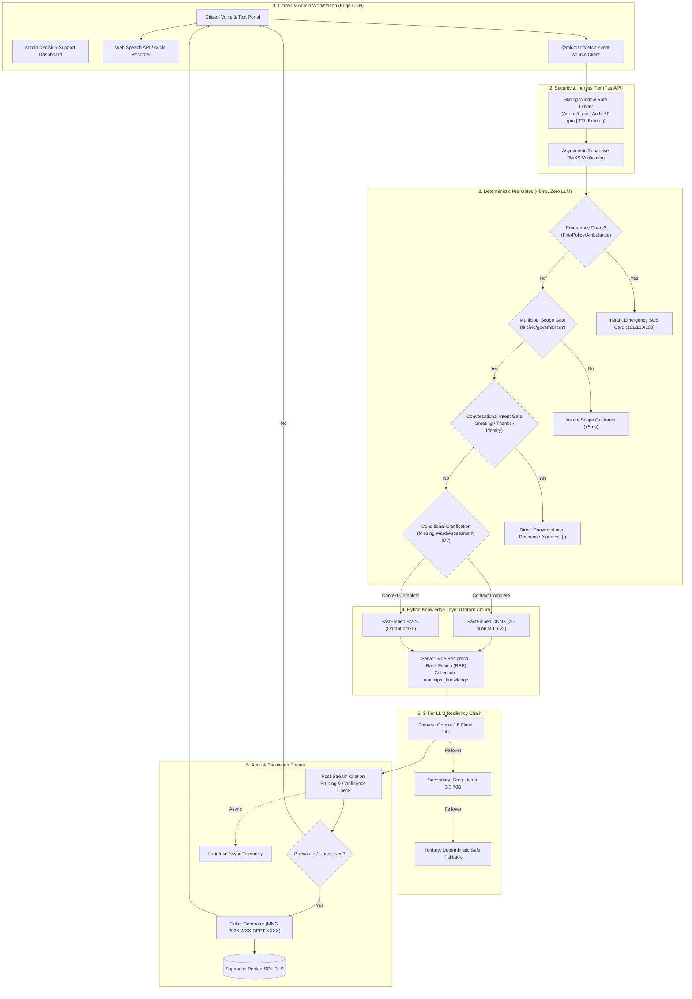

# 🏛️ Nagrik AI (नागरिक AI) — Municipal Knowledge Assistant & Decision Support System

<p align="center">
  
  
  
  
  
</p>

---

## 📑 Table of Contents

- [1. Overview &amp; Vision](#1-overview--vision)
- [2. System Architecture](#2-system-architecture)
  - [2.1 End-to-End Query &amp; Escalation Pipeline](#21-end-to-end-query--escalation-pipeline)
  - [2.2 Multilingual Voice &amp; Text Processing Flow](#22-multilingual-voice--text-processing-flow)
- [3. Key Modules](#3-key-modules)
  - [3.1 Citizen Concierge (Multilingual Voice &amp; Chat)](#31-citizen-concierge-multilingual-voice--chat)
  - [3.2 Autonomous Department Escalation Engine](#32-autonomous-department-escalation-engine)
  - [3.3 Executive Decision-Support Admin Dashboard](#33-executive-decision-support-admin-dashboard)
- [4. Production Invariants (Inherited from Prakriti AI)](#4-production-invariants-inherited-from-prakriti-ai)
- [5. Repository File Structure](#5-repository-file-structure)
- [6. Getting Started &amp; Local Setup](#6-getting-started--local-setup)
- [7. Operational Roadmaps](#7-operational-roadmaps)

---

## 1. Overview & Vision

**Nagrik AI** is an enterprise-grade AI municipal knowledge assistant and administrative decision-support system engineered to modernize public governance. Built upon the architectural learnings and security hardening of **Prakriti AI**, Nagrik AI integrates **Natural Language Processing (NLP)**, **Multilingual Speech/Text**, **Hybrid Vector Retrieval (RAG)**, and **Departmental Escalation Workflows** to serve two critical needs:

1. **Empowering Citizens**: Providing 24/7 access to accurate civic information in their mother tongue (English, Hindi, Marathi, Tamil, etc.), processing service requests, clarifying missing parameters through questionnaires, and lodging formal grievances with SLA-backed tracking.
2. **Empowering Municipal Administration**: Equipping Municipal Commissioners, Ward Officers, and Department Heads with real-time decision support, grievance heatmaps across wards, SLA breach warnings, and FAQ analytics to proactively fix service bottlenecks.

---

## 2. System Architecture

### 2.1 End-to-End Query & Escalation Pipeline



---

## 3. Key Modules

### 3.1 Citizen Concierge (Multilingual Voice & Chat)
* **Voice Mic HUD**: Citizens speak in their native language; Web Speech API or server-side Whisper converts audio to text in real-time with visualizer feedback.
* **Ward Profile HUD**: Persistent top-bar chip showing active Ward, Citizen Category (Residential, Commercial, Senior Citizen), and Language Preference.
* **Claude-Style Clarification Form**: Renders non-blocking inline questionnaire cards when critical parameters are missing (e.g., "Please select your Ward" or "Enter 10-digit Property ID").
* **Nature-Style Citation Hover Cards**: Inline citations `[S1]`, `[S2]` open instant micro-popovers displaying official gazette number, circular date, excerpt, and download link.

### 3.2 Autonomous Department Escalation Engine
* **Department Routing**:
  * `WTR`: Water Works, pipeline leaks, contaminated supply, billing issues.
  * `SAN`: Solid Waste Management, garbage bins, drain desilting, sanitation.
  * `REV`: Property Tax assessment, tax rebates, transfer of title, trade license.
  * `ENG`: Potholes, road maintenance, stormwater drains, culvert repairs.
  * `TNP`: Encroachments, illegal construction, building plan approvals.
  * `ELE`: Streetlight outages, loose electrical cables, high-mast illumination.
* **SLA Calculation**: Automatically assigns urgency and response deadlines (Emergency: 4 hours, High: 24 hours, Medium: 48 hours, Standard: 7 days).
* **Ticket Hash**: Generates standardized receipts with printable `@media print` whitepapers.

### 3.3 Executive Decision-Support Admin Dashboard
* **Ward Query & Complaint Heatmap**: Visualizes complaint density across wards to detect systemic failures (e.g., contamination spike in Ward 12).
* **SLA Countdown & Breach Monitor**: Live alerts for grievances nearing deadline expiration.
* **FAQ Trend Detection**: Real-time clustering of citizen queries to identify policy confusion before it leads to public dissatisfaction.
* **Knowledge-Gap Flagging**: Automatically flags citizen queries where retrieval returned low confidence, allowing officers to upload missing circulars.

---

## 4. Production Invariants (Inherited from Prakriti AI)

1. **Sub-Second TTFT via Lifespan Pre-Warming**: FastEmbed ONNX dense and sparse models are pre-warmed on FastAPI boot.
2. **Zero-LLM Pre-Filters**: Emergency SOS and out-of-scope queries bypass LLMs completely in <5ms.
3. **Strict Citation Truth**: Uncited candidate chunks are purged post-stream (`filter_cited_evidence`).
4. **Memory-Bounded Streaming Ingress**: Uploads stream in 64KB chunks under `MAX_UPLOAD_SIZE_MB` with `Content-Length` validation.
5. **SHA-256 Upload Deduplication**: Duplicates return `409 Conflict` before computing vectors.
6. **Bounded Rate Limiter**: Maximum 10,000 active tracking IPs with periodic TTL garbage collection.
7. **Multi-Tenant JWT Isolation**: Asymmetric JWKS cryptographic validation with auth bypass strictly isolated to `TESTING=True`.
8. **Client Link Protocol Filtering**: Blocks `javascript:` XSS vectors.

---

## 5. Repository File Structure

```
AI Municipal Chatbot/
├── .agents/                        # Agent customization system
│   ├── rules/                      # System-wide operational rules
│   │   ├── CIVIC_INVARIANTS.md
│   │   └── CODE_STANDARDS.md
│   └── skills/                     # Domain & workflow skills
│       ├── municipal-rag-orchestration/SKILL.md
│       ├── department-escalation/SKILL.md
│       ├── multilingual-voice-gateway/SKILL.md
│       └── civic-ui-workstation/SKILL.md
├── ARCHITECTURE.md                 # Full technical blueprint
├── MASTER_PROMPT.md                # System prompt for IDE agents
├── knowledge.md                    # Architectural trade-off history
├── backend/                        # FastAPI application
├── frontend/                       # React 18 + Vite workstation
└── data/                           # Municipal knowledge corpus
```

---

## 6. Getting Started & Local Setup

### Prerequisites
* Python 3.11+
* Node.js 18+
* Qdrant Cloud account & API Key
* Supabase account (Postgres + Auth)
* Google Gemini / Groq API Keys

### Quick Start
```bash
# 1. Install backend dependencies
cd backend
pip install -r requirements.txt

# 2. Seed municipal knowledge base
python -m src.scripts.seed_municipal_kb

# 3. Start backend API
uvicorn src.api.main:app --port 8000 --reload

# 4. Start frontend workstation
cd ../frontend
npm install
npm run dev
```

---

## 📄 License & Credits

Built for Municipal Corporations and Smart City Governance. Derived from the battle-tested engineering standards of **Prakriti AI** (Darukaa.Earth).
